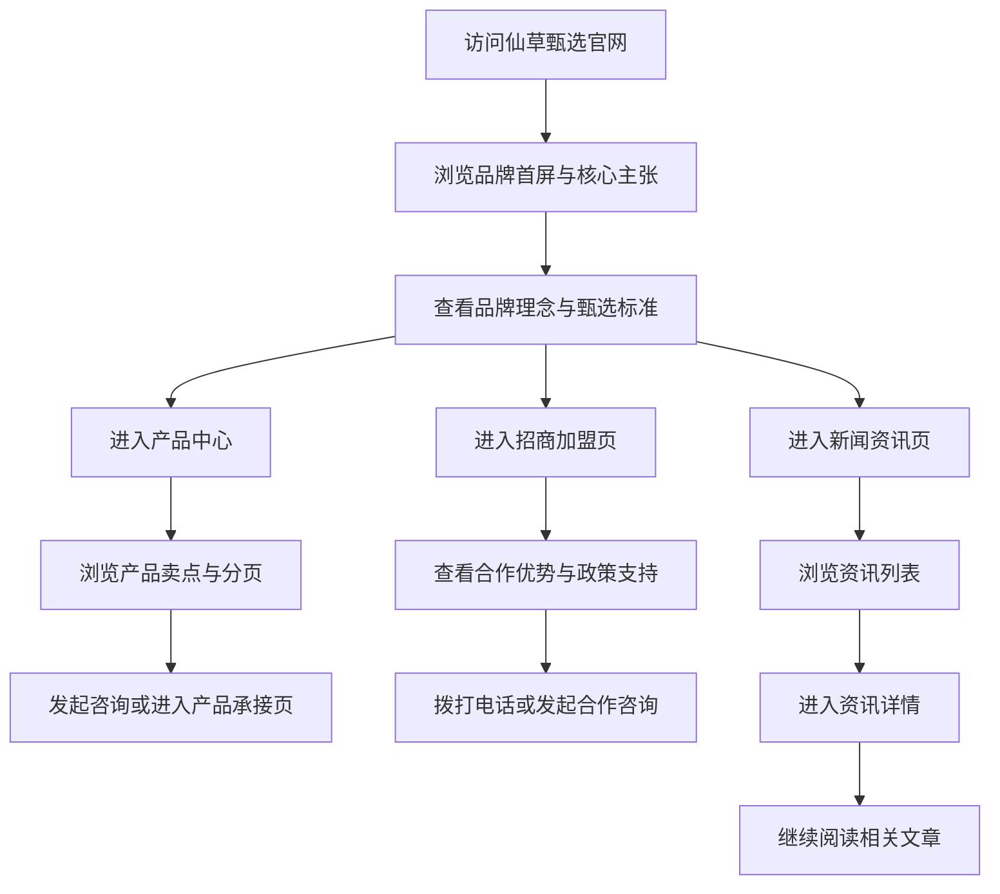

## 1. 产品概述
本项目目标是基于既有复刻 PRD 的页面结构与商业逻辑，为“仙草甄选”打造一套可直接上线的品牌官网，实现高质感品牌展示、产品承接、招商转化与内容传播。
- 项目核心是复用原站成熟的信息架构，同时将品牌表达、文案语境、视觉气质与产品设定替换为“仙草甄选”的东方草本滋养品牌形象。
- 项目价值在于快速形成一套具备展示力、成交力与延展性的品牌官网，为后续投放、渠道合作、招商与内容运营提供统一承载平台。

## 2. 核心功能

### 2.1 用户角色
本项目为品牌官网，无需登录，无角色区分。

### 2.2 功能模块
1. **首页**：品牌首屏、品牌故事、招商引导、核心产品、内容精选、联系方式。
2. **品牌中心页**：品牌理念、甄选标准、研发背书、品牌历程。
3. **招商加盟页**：投资前景、合作优势、加盟政策、合作流程、联系咨询。
4. **新闻资讯列表页**：品牌动态、行业洞察、内容精选、分页浏览。
5. **新闻详情页**：文章正文、相关新闻、上一篇下一篇导航。
6. **产品中心页**：产品卡片网格、产品卖点、分页浏览。
7. **全站公共区块**：顶部导航、侧边菜单、悬浮咨询、页脚信息。

### 2.3 页面详情
| 页面名称 | 模块名称 | 功能描述 |
|-----------|-------------|---------------------|
| 首页 | 顶部导航 | 品牌标识、栏目导航、招商入口、汉堡菜单 |
| 首页 | 首屏 Hero | 仙草甄选品牌主张、东方草本视觉、主 CTA、滚动引导 |
| 首页 | 品牌简介 | 展示品牌理念、甄选标准、草本养护价值与品牌差异化 |
| 首页 | 招商引导 | 展示合作主张、渠道价值、加盟入口与咨询按钮 |
| 首页 | 核心产品 | 展示主推产品、产品卖点、产品详情跳转 |
| 首页 | 资讯精选 | 展示品牌文章、行业资讯与详情跳转 |
| 首页 | 页脚 | 展示热线、渠道入口、公众号提示、备案与版权信息 |
| 品牌中心页 | 品牌主视觉 | 展示品牌大图、品牌口号与东方美学氛围 |
| 品牌中心页 | 品牌理念 | 展示仙草甄选的品牌使命、价值观与人群定位 |
| 品牌中心页 | 甄选标准 | 展示原料、配方、工艺、品控、溯源等品牌能力 |
| 品牌中心页 | 品牌背书 | 展示研发合作、质检标准、渠道合作、奖项荣誉 |
| 品牌中心页 | 品牌历程 | 展示品牌升级、产品节点与重要发展里程碑 |
| 招商加盟页 | 锚点导航 | 支持跳转投资前景、合作优势、政策支持、合作流程、联系咨询 |
| 招商加盟页 | 投资前景 | 展示滋补草本市场、消费者趋势与合作机会 |
| 招商加盟页 | 合作优势 | 展示品牌、产品、供应链、培训、运营支持 |
| 招商加盟页 | 招商政策 | 展示区域支持、陈列支持、营销支持、培训支持 |
| 招商加盟页 | 合作流程 | 展示沟通、评估、签约、培训、落地流程 |
| 招商加盟页 | 联系咨询 | 展示咨询电话、招商微信、办公地址与意向承接 |
| 新闻资讯列表页 | 焦点资讯 | 顶部展示主推资讯内容与跳转入口 |
| 新闻资讯列表页 | 资讯列表 | 展示文章缩略图、标题、摘要、日期与详情跳转 |
| 新闻资讯列表页 | 分页 | 支持多页切换浏览历史文章 |
| 新闻详情页 | 文章正文 | 展示标题、日期、正文、配图、分享入口 |
| 新闻详情页 | 相关推荐 | 展示近期文章列表与延伸阅读 |
| 新闻详情页 | 上下篇导航 | 支持上一篇与下一篇切换 |
| 产品中心页 | 顶部主视觉 | 展示品牌产品视觉与页面标题 |
| 产品中心页 | 产品列表 | 展示产品卡片、草本卖点、了解更多入口 |
| 产品中心页 | 分页 | 支持分页浏览更多产品 |
| 全站公共区块 | 侧边菜单 | 展示品牌栏目、联系方式、渠道入口 |
| 全站公共区块 | 悬浮工具 | 固定展示咨询、电话、返回顶部等快捷入口 |

## 3. 核心流程
用户通过首页建立对仙草甄选的品牌认知，再根据需求进入产品、招商或资讯页面，最终完成咨询、合作或进一步浏览。

## 4. 用户界面设计
### 4.1 设计风格
- 主色以深草木绿、药草金、暖米白为主，建立东方草本高端质感。
- 按钮采用深绿底金色描边或浅金底深色字的双体系，强化品牌识别。
- 字体采用具有东方气质的衬线标题字体搭配清晰正文黑体，形成品牌层次。
- 布局以大面积留白、图文错位、纵向叙事模块为主，整体偏高端、克制、自然。
- 图标与装饰使用线性图标、草本纹理、弧线分割与淡金描边。

### 4.2 页面设计概览
| 页面名称 | 模块名称 | UI 元素 |
|-----------|-------------|-------------|
| 首页 | 首屏 Hero | 深绿渐变背景、草本产品主视觉、金色点缀标题、主次 CTA、浮动纹理 |
| 首页 | 品牌简介 | 浅米白底、品牌短句、甄选卖点卡片、植物纹样细节 |
| 首页 | 招商引导 | 大图加数据亮点、合作按钮、品牌价值清单 |
| 首页 | 核心产品 | 卡片网格、产品卖点标签、草本成分说明、悬停动效 |
| 首页 | 资讯精选 | 重点图文卡与次级卡片组合、清晰阅读动线 |
| 品牌中心页 | 品牌背书与历程 | 图文交错、时间轴、质感底纹、数据与荣誉标签 |
| 招商加盟页 | 锚点长页 | 吸顶锚点、数据模块、图文模块、流程卡片、联系卡片 |
| 新闻详情页 | 内容双栏 | 左侧近期内容，右侧正文排版、分享区、跳转导航 |
| 产品中心页 | 产品网格 | 深浅层次背景、产品卡、成分标签、分页器 |
| 全站公共区块 | 头尾与浮层 | 透明头部、抽屉菜单、浮动咨询、品牌页脚 |

### 4.3 响应式策略
- 采用桌面优先设计，同时保证平板与移动端的完整体验。
- 桌面端突出氛围感与大图留白，移动端保留信息密度并优化 CTA 触达。
- 侧边菜单、锚点导航、浮动咨询与分页器分别提供桌面和移动端适配方案。

## 5. 页面树与实现范围
| 页面层级 | 页面路径 | 说明 |
|-----------|-------------|------|
| 一级页面 | `/` | 首页 |
| 一级页面 | `/brand` | 品牌中心 |
| 一级页面 | `/join` | 招商加盟 |
| 一级页面 | `/news` | 新闻资讯列表 |
| 二级页面 | `/news/:slug` | 新闻详情 |
| 一级页面 | `/products` | 产品中心 |
| 二级页面 | `/products/page/:page` | 产品分页 |

## 6. 验收标准
- **品牌转换正确**：整体品牌名称、文案语境、视觉气质统一为“仙草甄选”。
- **结构完整**：首页、品牌、招商、新闻、产品及全站公共模块完整可用。
- **视觉统一**：配色、字体、间距、按钮、模块风格统一，具备高端东方草本质感。
- **交互可用**：菜单、分页、锚点、咨询入口、路由跳转与悬浮工具可正常使用。
- **响应式达标**：桌面端与移动端均具备稳定排版与交互体验。
