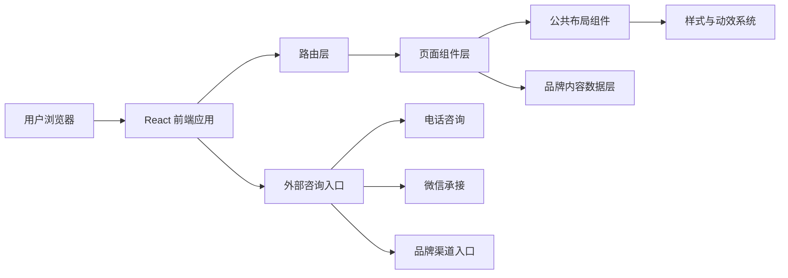

## 1. 架构设计
本项目采用前端静态官网架构，以 React 单页应用实现“仙草甄选”品牌官网。首期聚焦前端展示、路由切换、内容承载与咨询转化，后续如需接入 CMS 或表单系统可继续扩展。



## 2. 技术说明
- 前端：React 18 + TypeScript + Vite
- 路由：React Router
- 样式：Tailwind CSS 3 + 全局主题变量
- 动效：Framer Motion
- 状态管理：Zustand，用于菜单开关、滚动状态、筛选状态等轻量状态
- 数据方式：本地 `TS` 配置化内容数据
- 部署方式：静态部署，适配企业服务器、Nginx、Vercel、Netlify

## 3. 路由定义
| 路由 | 用途 |
|-------|---------|
| `/` | 首页，展示品牌主张、产品、资讯、招商入口 |
| `/brand` | 品牌中心页，展示品牌理念、甄选标准、品牌历程 |
| `/join` | 招商加盟页，展示合作价值、政策、流程与联系入口 |
| `/news` | 新闻资讯列表页 |
| `/news/:slug` | 新闻详情页 |
| `/products` | 产品中心列表页 |
| `/products/page/:page` | 产品分页列表页 |

## 4. 数据模型
```ts
export interface NavItem {
  label: string;
  enLabel: string;
  path: string;
}

export interface HeroContent {
  eyebrow: string;
  title: string;
  description: string;
  primaryCta: string;
  secondaryCta: string;
}

export interface ProductItem {
  id: string;
  name: string;
  subtitle: string;
  description: string;
  tags: string[];
  image: string;
  page: number;
}

export interface NewsItem {
  id: string;
  slug: string;
  title: string;
  summary: string;
  date: string;
  cover: string;
  content: string[];
}

export interface TimelineItem {
  year: string;
  title: string;
  description: string;
}

export interface JoinItem {
  id: string;
  title: string;
  description: string;
}
```

## 5. 目录结构
```text
src/
  assets/
    images/
  components/
    common/
    layout/
    sections/
  data/
    site.ts
    home.ts
    brand.ts
    join.ts
    news.ts
    products.ts
  hooks/
  pages/
    HomePage.tsx
    BrandPage.tsx
    JoinPage.tsx
    NewsListPage.tsx
    NewsDetailPage.tsx
    ProductsPage.tsx
  routes/
  store/
  styles/
  utils/
```

## 6. 页面模块拆分
### 6.1 公共模块
- `SiteHeader`：顶部导航、滚动状态、移动端菜单入口
- `MobileDrawer`：移动端侧滑菜单与导航
- `FloatingContact`：咨询、电话、回顶入口
- `SectionHeading`：中英文标题与说明文案统一模块
- `SiteFooter`：品牌信息、导航、热线与版权区
- `PageHero`：内页统一头图区
- `Pagination`：新闻与产品分页器

### 6.2 首页模块
- `HomeHeroSection`
- `BrandStorySection`
- `SelectionStandardSection`
- `JoinCtaSection`
- `FeaturedProductsSection`
- `FeaturedNewsSection`

### 6.3 品牌中心模块
- `BrandValuesSection`
- `BrandStandardsSection`
- `BrandHighlightsSection`
- `BrandTimelineSection`

### 6.4 招商加盟模块
- `JoinAnchorNav`
- `MarketOpportunitySection`
- `JoinAdvantagesSection`
- `SupportPolicySection`
- `JoinProcessSection`
- `JoinContactSection`

### 6.5 内容与产品模块
- `NewsFeaturedCard`
- `NewsList`
- `NewsArticle`
- `RecentNewsSidebar`
- `ProductGrid`
- `ProductCard`

## 7. 视觉实现策略
- 设计方向为“东方本草轻奢美学”，避免简单替换 Logo 的低质复刻。
- 主题色采用深绿、墨绿、暖金、米白和炭黑，形成稳定品牌层次。
- 使用有性格的标题字体与稳定正文黑体，提升品牌感与识别度。
- 背景中加入渐变、虚化光斑、细颗粒纹理和植物感边框，强化氛围。
- 保持组件统一圆角、留白、阴影与 hover 节奏，确保页面整体一致。

## 8. 交互规范
- 顶部导航支持桌面横向导航与移动端抽屉菜单。
- 首页与内页支持滚动显现动画与按钮悬停反馈。
- 招商页锚点导航支持平滑跳转和当前分区高亮。
- 新闻和产品支持分页路由，刷新后状态可恢复。
- 新闻详情支持上一篇下一篇与相关推荐联动。
- 浮动咨询区支持一键拨号、定位跳转与返回顶部。

## 9. 工程与性能要求
- 所有页面使用配置化数据驱动，避免重复硬编码。
- 组件尽量控制在单一职责内，便于维护与后续扩展。
- 首屏模块保证视觉完整并控制资源体积，非关键图采用懒加载。
- 统一 SEO 元信息与基础语义标签，支持品牌搜索曝光。
- 代码更新后执行 `npm run check`，并通过浏览器预览完成交互验证。

## 10. 开发拆分
| 阶段 | 目标 | 产出 |
|------|------|------|
| 阶段 1 | 初始化项目与主题系统 | React 项目、路由、主题样式、基础布局 |
| 阶段 2 | 实现首页与全站公共模块 | 首页、头部、页脚、抽屉菜单、浮动咨询 |
| 阶段 3 | 实现品牌与招商页面 | 品牌中心页、招商加盟页、锚点导航 |
| 阶段 4 | 实现新闻与产品中心 | 列表页、详情页、分页与数据映射 |
| 阶段 5 | 联调与验收 | 响应式、动效、检查脚本、预览验证 |
