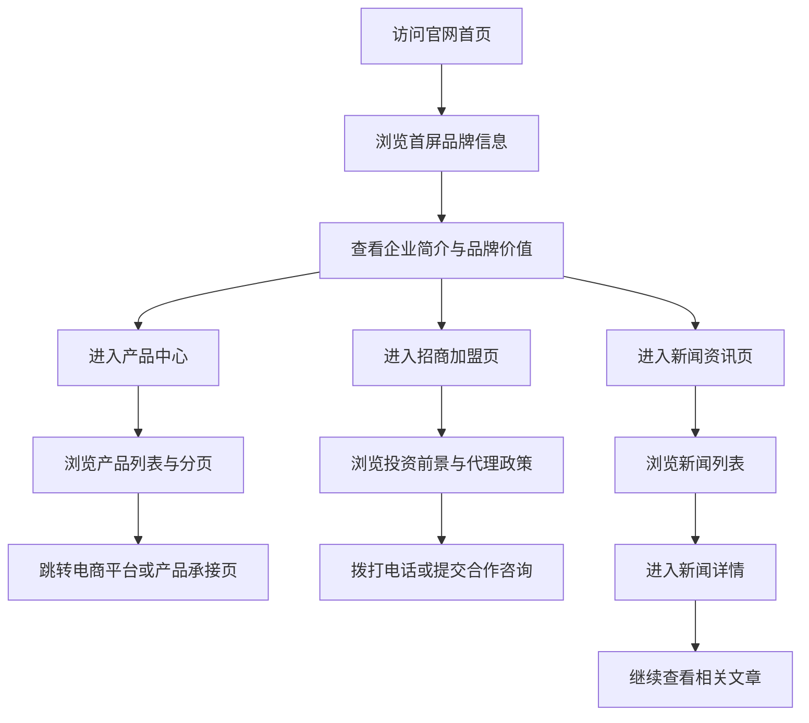

## 1. 产品概述
本项目目标是对 `http://www.yxcbj.com` 进行高还原度官网复刻，交付一套在视觉、结构、交互与内容组织上尽可能接近原站的前端实现方案。
- 项目核心是复刻品牌官网的信息架构、页面布局、品牌视觉、动效节奏与转化链路，用于品牌展示、招商引流、产品导流和新闻背书。
- 项目价值在于以可维护的现代前端方式重建原站，提升后续扩展能力、部署效率与多端适配能力。

## 2. 核心功能

### 2.1 用户角色
本项目为品牌展示型官网，无需区分登录角色。

### 2.2 功能模块
1. **首页**：首屏品牌展示、企业简介、招商引导、产品精选、新闻精选、底部联系方式。
2. **品牌中心页**：品牌理念、品牌价值、荣誉资质、合作背书、发展历程。
3. **招商加盟页**：页内锚点导航、投资前景、代理优势、代理政策、代理流程、合作申请。
4. **新闻资讯列表页**：焦点新闻、新闻卡片列表、分页浏览。
5. **新闻详情页**：文章正文、近期新闻侧栏、上一篇下一篇导航、分享入口。
6. **产品中心列表页**：产品卡片网格、分页、跳转电商平台或产品详情承接。
7. **全站公共区块**：顶部导航、侧滑菜单、右侧悬浮工具栏、页脚联系方式与外链入口。

### 2.3 页面详情
| 页面名称 | 模块名称 | 功能描述 |
|-----------|-------------|---------------------|
| 首页 | 顶部导航 | 左侧品牌 Logo，右侧汉堡菜单，支持打开全站侧滑导航 |
| 首页 | 首屏 Hero | 红橙品牌视觉背景、产品主视觉、品牌文案、滚动提示、右侧悬浮客服工具 |
| 首页 | 企业简介 | 展示品牌定位、安全标准、工艺说明与品牌价值主张 |
| 首页 | 招商加盟引导 | 展示招商主文案、加盟入口按钮、门店或空间效果图 |
| 首页 | 热销产品 | 展示精选产品卡片，支持跳转产品中心 |
| 首页 | 新闻资讯精选 | 展示一条重点新闻和多条新闻卡片，支持跳转列表和详情 |
| 首页 | 页脚 | 展示热线电话、微信/京东/天猫入口、公众号提示、备案信息 |
| 品牌中心页 | 顶部视觉区 | 展示品牌大图、核心口号、品牌形象主视觉 |
| 品牌中心页 | 品牌理念区 | 展示品牌使命、服务承诺、健康生活方式倡导等内容 |
| 品牌中心页 | 荣誉背书区 | 展示奖项、协会资质、媒体合作、赛事合作等品牌信任信息 |
| 品牌中心页 | 发展历程区 | 通过时间轴或分段列表展示品牌升级与重要节点 |
| 招商加盟页 | 页内锚点导航 | 固定或吸顶锚点，点击跳转投资前景、代理优势、代理政策、代理流程、合作申请 |
| 招商加盟页 | 投资前景 | 展示行业增长、市场规模、趋势图表与招商说服内容 |
| 招商加盟页 | 代理优势 | 展示品牌、产品、渠道、服务、供应链等招商优势 |
| 招商加盟页 | 代理政策 | 展示合作支持、区域政策、培训支持、营销支持等 |
| 招商加盟页 | 代理流程 | 展示合作流程、对接节点与申请步骤 |
| 招商加盟页 | 合作申请 | 展示电话、联系人、办公地址与表单或咨询入口 |
| 新闻资讯列表页 | 焦点新闻 | 顶部展示主推新闻大卡，突出标题、摘要和跳转按钮 |
| 新闻资讯列表页 | 新闻列表 | 展示多条新闻缩略图、标题、日期、摘要与详情跳转 |
| 新闻资讯列表页 | 分页 | 支持分页切换浏览历史新闻内容 |
| 新闻详情页 | 文章正文 | 展示新闻标题、发布日期、正文内容、图片和分享图标 |
| 新闻详情页 | 近期新闻侧栏 | 展示 Recent News 列表，支持快速跳转相关文章 |
| 新闻详情页 | 上下篇导航 | 支持切换上一篇与下一篇文章 |
| 产品中心页 | 顶部主视觉 | 展示产品主视觉、页面标题与品牌色延续 |
| 产品中心页 | 产品列表 | 以双列或多列卡片方式展示产品图、名称与跳转入口 |
| 产品中心页 | 分页 | 支持至少两页产品列表切换 |
| 全站公共区块 | 侧滑菜单 | 从右侧展开导航，展示中英双语栏目与外链入口 |
| 全站公共区块 | 悬浮工具栏 | 固定展示微信、电话、返回顶部等快捷入口 |

## 3. 核心流程
用户通过首页或任意栏目进入官网，完成品牌认知、产品浏览、新闻了解与招商咨询等行为；不同页面通过统一头部、悬浮入口与 CTA 形成闭环转化。

## 4. 用户界面设计
### 4.1 设计风格
- 主色为高饱和中国红、深红、橘红渐变，辅助色为白色与浅灰色。
- 按钮以红底白字圆角按钮为主，辅以白底红字次级按钮。
- 字体采用中文主标题配英文辅助标题的组合，标题字号明显偏大，正文规整清晰。
- 页面布局以移动端视觉优先的模块化长页面为核心，桌面端延展为更宽的留白版式。
- 图标风格以简洁线性图标和品牌化红色圆形悬浮按钮为主。

### 4.2 页面设计概览
| 页面名称 | 模块名称 | UI 元素 |
|-----------|-------------|-------------|
| 首页 | 首屏 Hero | 红橙渐变背景、产品瓶身或礼盒主视觉、大字号白色文案、滚动提示、悬浮客服按钮 |
| 首页 | 企业简介 | 白灰底色、红色短横线标题装饰、品牌 Logo、段落文案、适度留白 |
| 首页 | 招商加盟引导 | 红色高对比背景、英文大字氛围字、招商 CTA、大图展示 |
| 首页 | 热销产品 | 双列产品卡片、高清产品图、产品名称、统一按钮样式 |
| 首页 | 新闻资讯精选 | 重点大卡加次级卡片混排、标题摘要、缩略图、列表节奏分明 |
| 品牌中心页 | 荣誉与历程 | 红白灰配色、时间轴感布局、图文交错、品牌背书信息强化 |
| 招商加盟页 | 锚点长页 | 顶部锚点导航、数据图表、图文模块、联系信息卡片 |
| 新闻详情页 | 双栏详情 | 左侧近期新闻列表、右侧正文、社交分享、上一篇下一篇 |
| 产品中心页 | 产品网格 | 品牌色标题区、产品网格卡片、分页器、悬停反馈 |
| 全站公共区块 | 头尾与浮层 | 顶部吸附、侧滑菜单、右侧浮动按钮、热线区与备案底栏 |

### 4.3 响应式策略
- 采用桌面优先设计并兼容移动端，视觉标准以原站移动端风格为参考基准。
- 桌面端保留大面积留白与横向布局，移动端将模块自然堆叠并延续 CTA 层级。
- 招商锚点导航、悬浮工具栏、分页器和新闻双栏布局需要分别设计桌面与移动态样式。

## 5. 页面树与还原范围
| 页面层级 | 原站参考路径 | 说明 |
|-----------|-------------|------|
| 一级页面 | `/` | 首页 |
| 一级页面 | `/category_7.html` 或品牌中心对应入口 | 品牌中心 |
| 一级页面 | `/category_8.html` | 招商加盟 |
| 一级页面 | `/category_4.html` | 新闻资讯列表 |
| 二级页面 | `/contentxxx.html` | 新闻详情页模板 |
| 一级页面 | `/category_5.html` | 产品中心列表 |
| 二级页面 | `/category_5_p2.html` | 产品中心分页模板 |

## 6. 复刻目标与验收标准
- **结构还原**：导航层级、页面顺序、模块编排与原站保持一致。
- **视觉还原**：配色、版式、字体层级、按钮风格、背景氛围和图片占比尽量贴近原站。
- **交互还原**：汉堡菜单、侧滑导航、悬浮工具栏、页内锚点、分页、上下篇导航等行为与原站一致。
- **内容还原**：现有公开文案、产品名称、新闻标题、联系方式、外链入口等内容需按授权范围同步。
- **适配验收**：桌面端与移动端均保持模块完整、视觉稳定、可交互。

## 7. 实施约束与风险说明
- 若要求真正意义上的“一比一复刻”，需补充原站所有高清素材、原始文案、字体授权与图片版权授权。
- 若原站存在历史数据或后台动态接口，当前方案默认先按静态官网展示层进行前端复刻。
- 若需完全一致的新闻、产品和加盟内容维护能力，建议在后续阶段补充内容管理后台。
- 若原站依赖第三方脚本、统计、地图或表单服务，复刻时需要额外确认替代方案或接入方式。
