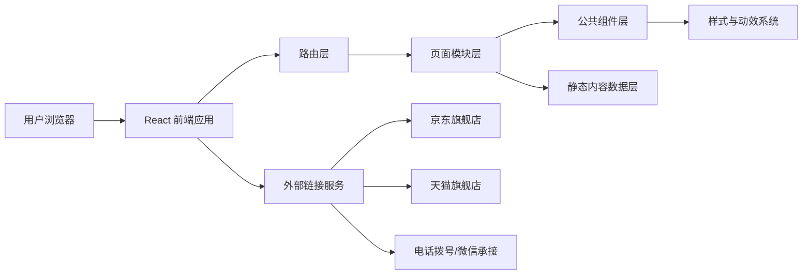

## 1. 架构设计
本项目采用前后端解耦的静态官网优先架构，首期聚焦高还原前端实现；如后续需要内容维护、新闻管理或产品管理，再补充后台服务。



## 2. 技术说明
- 前端：React 18 + TypeScript + Vite
- 样式方案：Tailwind CSS 3 + 少量 CSS Module 或全局样式补充
- 路由方案：React Router
- 动效方案：Framer Motion 或 CSS Transition，用于首屏、侧滑菜单、滚动显现与锚点过渡
- 资源管理：本地静态资源目录 + 可配置内容数据文件
- 初始化工具：Vite
- 部署方式：静态站点部署，支持 Nginx、Vercel、Netlify 或企业自有服务器

## 3. 路由定义
| 路由 | 用途 |
|-------|---------|
| `/` | 首页，展示品牌、招商、产品精选、新闻精选、联系方式 |
| `/brand` | 品牌中心页，展示品牌故事、荣誉、理念、历程 |
| `/join` | 招商加盟页，展示投资前景、代理优势、代理政策、代理流程、合作申请 |
| `/news` | 新闻资讯列表页 |
| `/news/:slug` | 新闻详情页 |
| `/products` | 产品中心列表页 |
| `/products/page/:page` | 产品分页列表页 |

## 4. API 定义
首期官网复刻可不依赖后端接口，采用静态数据驱动页面渲染；如需后续扩展，可预留以下前端数据模型。

```ts
export interface NavItem {
  label: string;
  enLabel: string;
  path?: string;
  external?: boolean;
  children?: NavItem[];
}

export interface HeroBanner {
  title: string;
  subtitle?: string;
  description?: string;
  image: string;
  ctaLabel?: string;
  ctaLink?: string;
}

export interface NewsItem {
  id: string;
  slug: string;
  title: string;
  summary: string;
  date: string;
  cover: string;
  content: string;
  relatedIds?: string[];
}

export interface ProductItem {
  id: string;
  name: string;
  cover: string;
  description?: string;
  externalLink?: string;
  page: number;
}

export interface JoinSection {
  id: string;
  title: string;
  content: string[];
  image?: string;
}

export interface ContactInfo {
  hotline: string;
  address: string;
  wechatQr: string;
  jdLink?: string;
  tmallLink?: string;
}
```

## 5. 数据组织方案
### 5.1 数据来源
- 导航、首页模块、产品列表、新闻列表、联系方式建议采用本地 `JSON` 或 `TS` 配置文件维护。
- 新闻详情正文可使用 `Markdown` 或富文本结构体，便于后续迁移到 CMS。
- 品牌中心与招商加盟页内容建议按区块拆分，避免把整页文案写死在组件中。

### 5.2 建议目录结构
```text
src/
  assets/
    images/
    icons/
  components/
    common/
    layout/
    sections/
  data/
    nav.ts
    home.ts
    brand.ts
    join.ts
    news.ts
    products.ts
    contact.ts
  pages/
    Home/
    Brand/
    Join/
    NewsList/
    NewsDetail/
    Products/
  routes/
  styles/
  utils/
```

## 6. 页面模块拆分
### 6.1 公共组件
- `SiteHeader`：Logo、汉堡按钮、吸顶态切换
- `SideDrawerMenu`：右侧滑出导航、中英双语菜单、电商与联系方式入口
- `FloatingActions`：微信、电话、返回顶部悬浮工具
- `SectionTitle`：中文标题、英文副标题、红色装饰线的统一标题组件
- `SiteFooter`：热线电话、公众号引导、京东/天猫/微信入口、备案信息
- `Pagination`：新闻列表与产品列表的分页器

### 6.2 首页模块
- `HomeHeroSection`
- `CompanyProfileSection`
- `JoinHighlightSection`
- `StoreShowcaseSection`
- `FeaturedProductsSection`
- `FeaturedNewsSection`

### 6.3 品牌中心页模块
- `BrandHeroSection`
- `BrandMissionSection`
- `BrandValuesSection`
- `BrandHonorsSection`
- `BrandTimelineSection`

### 6.4 招商加盟页模块
- `JoinHeroSection`
- `JoinAnchorNav`
- `InvestmentProspectSection`
- `AgencyAdvantageSection`
- `AgencyPolicySection`
- `AgencyProcessSection`
- `JoinContactSection`

### 6.5 新闻与产品页模块
- `NewsFeaturedCard`
- `NewsCardList`
- `NewsSidebarRecent`
- `NewsArticleContent`
- `ProductGrid`
- `ProductCard`

## 7. 交互实现规范
- 汉堡菜单：点击后从右侧滑出，遮罩层覆盖内容区域，支持点击遮罩关闭和 ESC 关闭。
- 吸顶头部：页面滚动超过首屏后切换为白底或半透明吸顶状态。
- 悬浮工具栏：桌面端固定右侧中部，移动端转为底部浮层或缩小尺寸。
- 锚点导航：招商加盟页使用平滑滚动，并在滚动过程中高亮当前区块。
- 列表分页：产品页和新闻页需要支持可点击分页，URL 保持可分享。
- 详情跳转：新闻详情页保留上一篇/下一篇导航与近期新闻列表联动。
- 动效控制：以淡入、上移、滑出为主，保持品牌官网稳重质感，避免过度炫技。

## 8. 视觉还原策略
### 8.1 样式系统
- 将品牌主色抽离为 CSS Variables，例如主红、深红、橙红、浅灰、正文深灰。
- 建立统一圆角、阴影、按钮尺寸、标题字号、段落行高规范。
- 为首页、品牌页、招商页分别定义背景氛围和大图比例规则。

### 8.2 还原重点
- 优先还原首屏视觉比例、CTA 位置、模块间距、标题层级和图片裁切方式。
- 重点保留“中文标题 + 英文辅助标题 + 红色装饰线”的品牌识别语言。
- 重点还原右侧悬浮工具栏、侧滑菜单、招商锚点和新闻双栏详情模板。

### 8.3 素材处理
- 产品图、品牌图、证书图、新闻图建议以 `webp` 为主并提供高清原图备份。
- 若无法直接获取原站素材，需要由甲方提供授权素材，避免使用低清截图影响还原度。
- 字体如需完全接近原站，需要确认商用授权；若无授权，需寻找视觉相近替代字体。

## 9. 性能与工程要求
- 首页首屏图片采用懒加载之外的优先加载策略，确保品牌视觉首屏完整。
- 其他长页面图片采用懒加载与尺寸占位，减少布局抖动。
- 所有页面需支持基础 SEO：标题、描述、OG 图、语义化结构。
- 电话、京东、天猫、微信等外链需统一封装，便于后续配置替换。
- 保持组件可复用与数据驱动，避免因完全写死页面而导致后期维护困难。

## 10. 开发阶段拆分
| 阶段 | 目标 | 产出 |
|------|------|------|
| 阶段 1 | 搭建项目骨架与设计变量 | 路由、样式变量、公共布局组件 |
| 阶段 2 | 完成首页与公共头尾 | 首页主模块、侧滑菜单、悬浮工具栏、页脚 |
| 阶段 3 | 完成品牌中心与招商加盟页 | 品牌页、锚点页、招商内容模块 |
| 阶段 4 | 完成新闻列表/详情与产品中心 | 列表模板、详情模板、分页 |
| 阶段 5 | 细节还原与响应式优化 | 动效、状态、适配、SEO、验收修正 |

## 11. 风险与补充说明
- 若需要“像素级”一致，必须获取原站切图、原始字体、交互动效细节与隐藏页面清单。
- 若原站存在后台驱动的数据更新逻辑，静态复刻只能先满足展示一致，不能自动同步原站数据。
- 若需要后续接 CMS，建议在当前阶段保留数据模型与模块化组件设计，不直接把文案写死。
- 若需部署到正式生产环境，需补充域名、备案、HTTPS、统计代码和表单承接方案。
